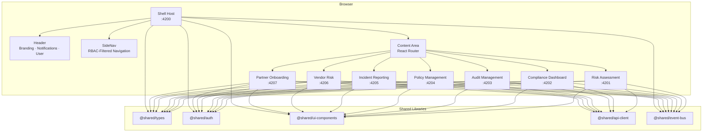
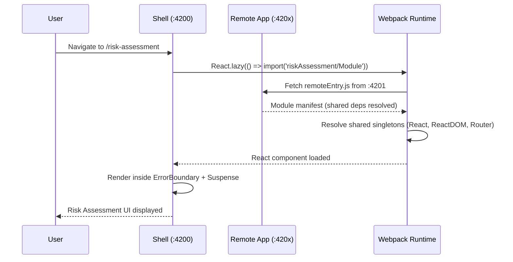
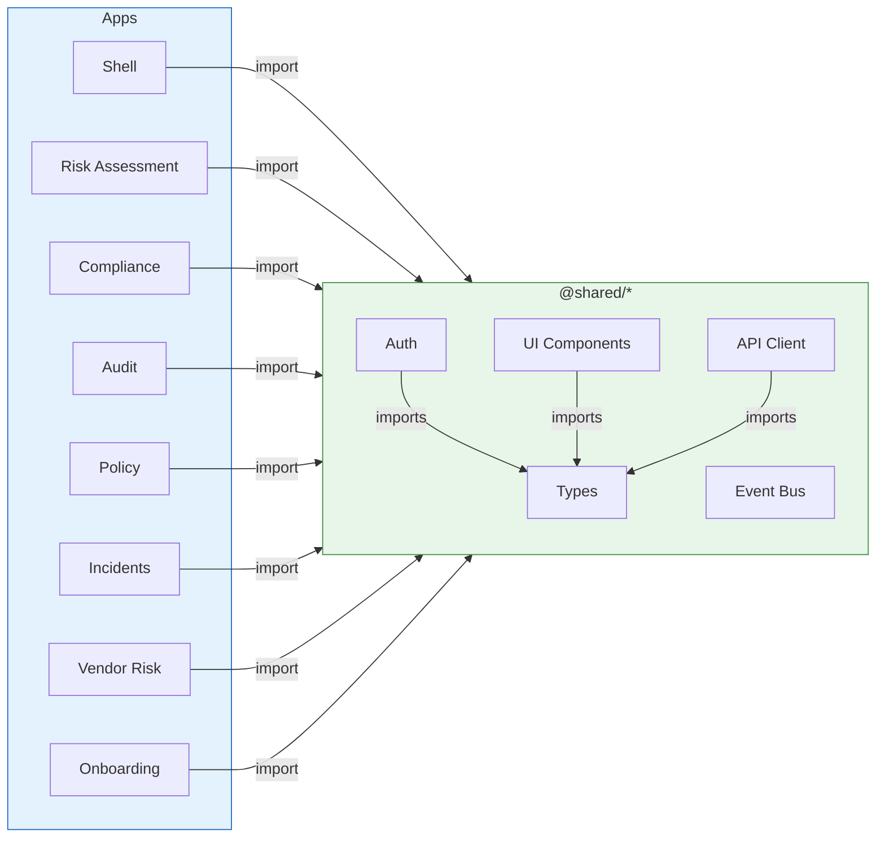
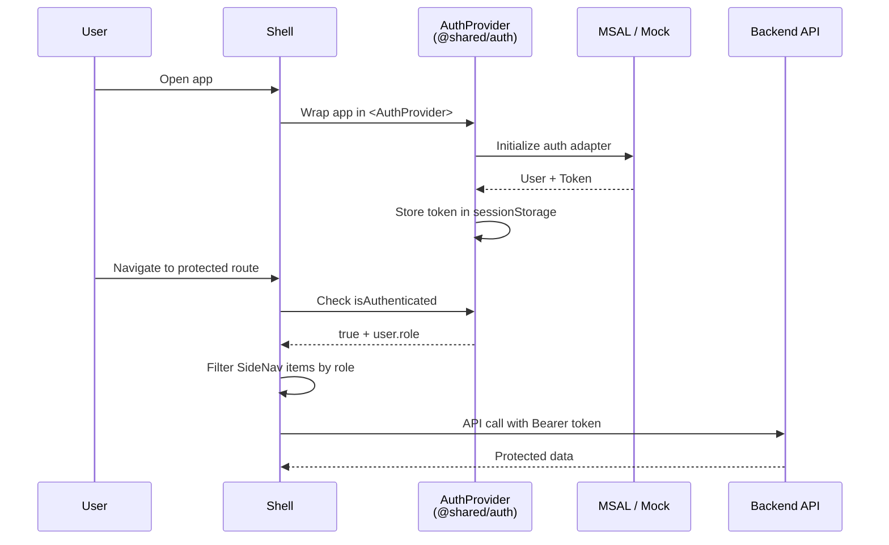
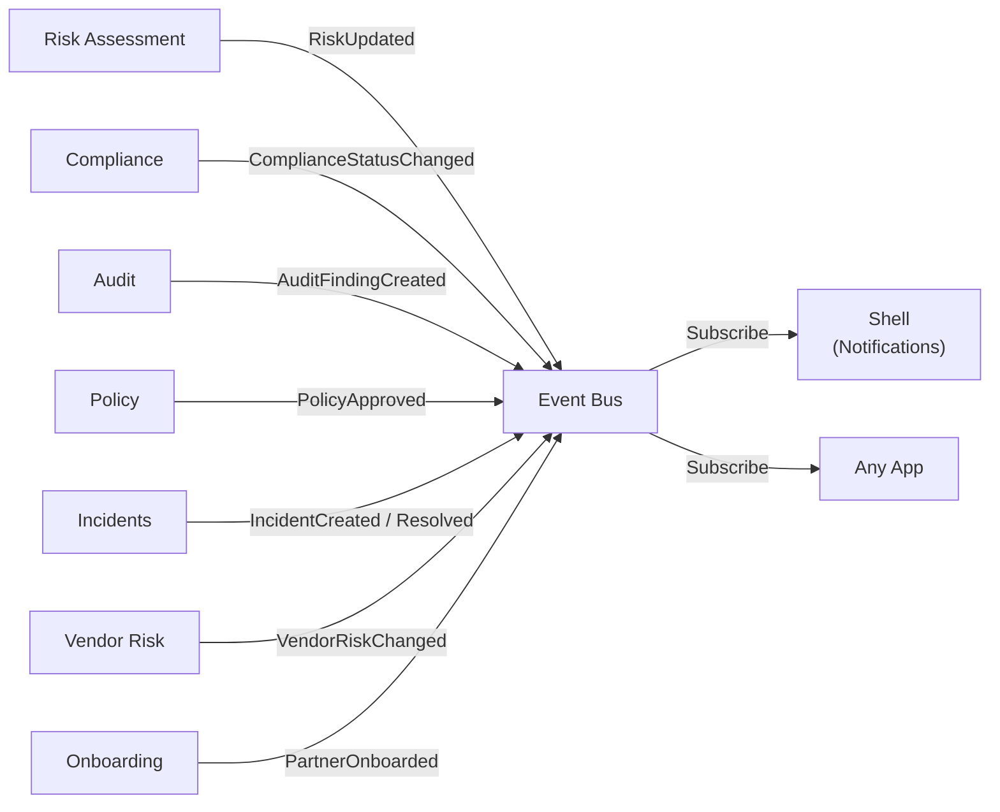
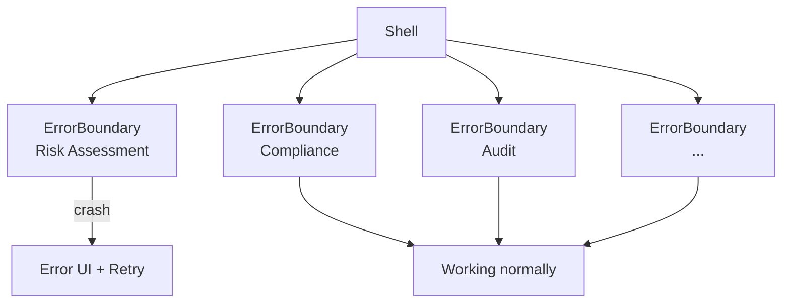

# Architecture — Partner Portal Micro-Frontend Platform

> Comprehensive architecture reference for the Partner Portal micro-frontend platform.
> Every developer and AI assistant **must** read this before making changes.

---

## System Overview



---

## Module Federation Architecture



### Shared Singleton Dependencies

These packages are loaded **once** by the shell and shared with all remotes:

| Package | Singleton | Strategy |
|---------|-----------|----------|
| `react` | Yes | Shell provides, remotes consume |
| `react-dom` | Yes | Shell provides, remotes consume |
| `react-router-dom` | Yes | Single router instance in shell |

### Port Registry

| App | Port | Federation Name | Exposed Module |
|-----|------|----------------|----------------|
| Shell (Host) | 4200 | `shell` | N/A (consumer) |
| Risk Assessment | 4201 | `riskAssessment` | `./Module` |
| Compliance Dashboard | 4202 | `complianceDashboard` | `./Module` |
| Audit Management | 4203 | `auditManagement` | `./Module` |
| Policy Management | 4204 | `policyManagement` | `./Module` |
| Incident Reporting | 4205 | `incidentReporting` | `./Module` |
| Vendor Risk | 4206 | `vendorRisk` | `./Module` |
| Partner Onboarding | 4207 | `partnerOnboarding` | `./Module` |

---

## Dependency Flow



### Rules

1. **Apps → Libs**: Apps may import from any `@shared/*` library.
2. **Libs → Libs**: Libraries may import from `@shared/types` only. No circular dependencies.
3. **App → App**: **NEVER** import from one app into another. Use `@shared/event-bus` for cross-app communication.
4. **Shell → Remotes**: Only via Module Federation `import('remoteName/Module')`. No direct file imports.

---

## Authentication Flow



### Auth Adapters

| Adapter | Use Case | Config |
|---------|----------|--------|
| **Mock (current)** | Local development | Auto-authenticated as `Admin` |
| **MSAL (future)** | Azure Entra ID | `MSAL_CLIENT_ID`, `MSAL_AUTHORITY` env vars |

### RBAC Permission Matrix

Defined in `libs/shared/auth/src/lib/usePermission.ts`:

| Resource | view | create | edit | delete | approve | publish | assess | report | investigate | resolve | onboard | bulkInvite |
|----------|------|--------|------|--------|---------|---------|--------|--------|-------------|---------|---------|------------|
| risk | All | A,CO | A,CO | A | A,CO | — | — | — | — | — | — | — |
| compliance | All | — | A,CO | — | — | — | A,CO,Au | — | — | — | — | — |
| audit | A,Au,CO,V | A,Au | A,Au | — | — | — | — | — | — | — | — | — |
| policy | A,CO,P,V | A,CO | — | — | A | A | — | — | — | — | — | — |
| incident | A,CO,P,V | — | — | — | — | — | — | A,CO,P | A,CO | A,CO | — | — |
| vendor | A,CO,V | A,CO | A,CO | — | — | — | A,CO,Au | — | — | — | — | — |
| partner | A,P,V | — | — | — | A | — | — | — | — | — | A,P | A |

> A=Admin, Au=Auditor, CO=ComplianceOfficer, P=Partner, V=Viewer

---

## Event Bus Communication



### Event Types

| Event | Payload | Producer | Consumers |
|-------|---------|----------|-----------|
| `RISK_UPDATED` | `{ riskId, riskLevel }` | Risk Assessment | Compliance, Shell |
| `COMPLIANCE_STATUS_CHANGED` | `{ controlId, newStatus }` | Compliance | Audit, Shell |
| `AUDIT_FINDING_CREATED` | `{ findingId, severity }` | Audit | Risk, Shell |
| `POLICY_APPROVED` | `{ policyId, version }` | Policy | Compliance, Shell |
| `INCIDENT_CREATED` | `{ incidentId, severity }` | Incidents | Risk, Shell |
| `INCIDENT_RESOLVED` | `{ incidentId }` | Incidents | Shell |
| `VENDOR_RISK_CHANGED` | `{ vendorId, newRating }` | Vendor Risk | Risk, Shell |
| `PARTNER_ONBOARDED` | `{ partnerId, companyName }` | Onboarding | Shell |
| `USER_ROLE_CHANGED` | `{ userId, newRole }` | Auth/Shell | All Apps |
| `NAVIGATION_REQUESTED` | `{ path }` | Any App | Shell |
| `NOTIFICATION_RECEIVED` | `{ message, type }` | Any | Shell |

---

## Design Token System

All components use CSS custom properties for consistent theming:

```css
:root {
  /* Colors */
  --color-primary: #2563eb;
  --color-secondary: #64748b;
  --color-danger: #dc2626;
  --color-surface: #ffffff;
  --color-border: #e2e8f0;
  --color-text: #1e293b;
  --color-text-secondary: #64748b;
  --color-selected: #eff6ff;

  /* Layout */
  --header-height: 56px;
  --sidebar-width: 260px;

  /* Spacing */
  --spacing-xs: 4px;
  --spacing-sm: 8px;
  --spacing-md: 16px;
  --spacing-lg: 24px;
  --spacing-xl: 32px;
}
```

### Rules
- **Never use raw color values** in components. Always use `var(--color-*)`.
- **Never use magic numbers** for spacing. Use `var(--spacing-*)`.
- **All styling** uses inline `style` objects or CSS custom properties. No CSS modules, no Tailwind.

---

## Provider Hierarchy

The shell bootstraps the following provider tree:

```
<StrictMode>
  <BrowserRouter>
    <AuthProvider>                    ← Authentication context
      <App>                          ← Layout (Header + SideNav + Content)
        <Suspense>                   ← Loading fallback for lazy imports
          <ErrorBoundary>            ← Per-remote error isolation
            <RemoteApp />            ← Module Federation component
          </ErrorBoundary>
        </Suspense>
      </App>
    </AuthProvider>
  </BrowserRouter>
</StrictMode>
```

---

## Error Isolation Strategy



- Each remote app is wrapped in its own `<ErrorBoundary>`.
- If Risk Assessment crashes, Compliance/Audit/etc. continue working.
- Error fallback shows module name + retry button with `role="alert"`.

---

## Testing Strategy

| Layer | Framework | Focus |
|-------|-----------|-------|
| Shared Libraries | Vitest / Jest | Unit tests, prop validation, accessibility (jest-axe) |
| Micro-Apps | Vitest / Jest + RTL | Integration tests, user behavior, RBAC gating |
| Shell | Vitest / Jest + RTL | Routing, remote loading, error boundaries |
| E2E | Playwright (future) | Full user flows across apps |

### Testing Rules
- Use semantic queries: `getByRole`, `getByLabelText`, `getByText` — **never** `getByTestId`.
- `vi.clearAllMocks()` in `beforeEach`.
- Wrap state changes in `act()`.
- Use `waitFor()` for async assertions.
- Test both light/dark theme variants for UI components.
- Every UI component must pass `jest-axe` accessibility checks.

---

## Directory Structure Reference

```
partner-portal-microfrontends/
├── apps/
│   ├── shell/                     # Host application
│   │   ├── src/
│   │   │   ├── App.tsx            # Root layout + routes
│   │   │   ├── bootstrap.tsx      # React DOM render
│   │   │   ├── index.ts           # Async entry (MF bootstrap)
│   │   │   ├── index.html         # HTML template + security headers
│   │   │   ├── remotes.d.ts       # TypeScript declarations for remotes
│   │   │   └── components/
│   │   │       ├── Header.tsx     # Top navigation bar
│   │   │       ├── SideNav.tsx    # Side navigation (RBAC filtered)
│   │   │       └── ErrorBoundary.tsx  # Per-remote error isolation
│   │   ├── webpack.config.js      # Host MF config
│   │   ├── project.json           # Nx project config
│   │   └── tsconfig.app.json      # App TypeScript config
│   │
│   └── [micro-app]/               # 7 remote apps (same structure)
│       ├── src/
│       │   ├── bootstrap.tsx      # Standalone render
│       │   ├── index.ts           # Async entry
│       │   ├── index.html         # Standalone HTML
│       │   └── remote-entry.tsx   # Exported component (MF entry)
│       ├── webpack.config.js      # Remote MF config (uses factory)
│       ├── project.json           # Nx project config
│       └── tsconfig.app.json      # App TypeScript config
│
├── libs/shared/
│   ├── types/                     # Domain models, enums, interfaces
│   ├── auth/                      # AuthProvider, RBAC, ProtectedRoute
│   ├── ui-components/             # 11 WCAG-compliant components
│   ├── api-client/                # HTTP client + mock data
│   └── event-bus/                 # Typed pub/sub system
│
├── tools/webpack/
│   └── remoteConfig.js            # Webpack config factory for remotes
│
├── .github/workflows/
│   ├── ci.yml                     # Lint + Build + Test
│   └── deploy.yml                 # Azure deployment
│
├── nx.json                        # Nx workspace configuration
├── tsconfig.base.json             # Base TypeScript (paths, strict mode)
├── package.json                   # Root deps + scripts
├── ARCHITECTURE.md                # This file
├── CONTRIBUTING.md                # Development guidelines
└── README.md                      # Quick start + overview
```

---

## Adding a New Micro-App

1. Create `apps/new-app/` following the remote structure above.
2. Add `remote-entry.tsx` with default export React component.
3. Add `webpack.config.js` using `createRemoteWebpackConfig({ name, port, appDir })`.
4. Register in `apps/shell/webpack.config.js` remotes.
5. Add `remotes.d.ts` declaration in shell.
6. Add lazy import + route + ErrorBoundary in `App.tsx`.
7. Add `NavItem` in `SideNav.tsx` with role-based visibility.
8. Register permissions in `PERMISSION_MATRIX` in `usePermission.ts`.
9. Add start script in root `package.json`.
10. Create `README.md` in the new app folder following the template.

---

## Security Architecture

- **Auth tokens**: `sessionStorage` only (cleared on tab close). Never `localStorage`.
- **HTTP headers**: Set in `index.html` — `X-Content-Type-Options: nosniff`, `X-Frame-Options: DENY`, `Referrer-Policy: strict-origin-when-cross-origin`, `Permissions-Policy: camera=(), microphone=()`.
- **RBAC enforcement**: Navigation-level (SideNav filtering) + Action-level (`usePermission` hook in each app).
- **CORS**: `Access-Control-Allow-Origin: *` in dev server only. Production CORS configured at CDN/reverse proxy.
- **No secrets in code**: All sensitive config via environment variables or GitHub Secrets.
- **Input validation**: All form inputs validated before API submission.
- **CSP**: Content Security Policy meta tag in `index.html`.

---

## Future Roadmap (Oscar-Inspired Enhancements)

These patterns from the Oscar platform architecture are planned for adoption:

1. **Config-Driven UI** — Define dashboards as JSON configs, render dynamically.
2. **Theme Toggle** — Light/dark mode with MUI ThemeProvider + CSS variables.
3. **i18n** — `react-i18next` for internationalization.
4. **SSE Real-Time** — Server-Sent Events for live dashboard updates.
5. **Plugin System** — Runtime-loadable plugins from CDN.
6. **Zustand** — View-scoped state management for complex dashboards.
7. **Centralized Versions** — `versions.json` single source of truth for dependencies.
8. **Agentic Chat** — Shell-owned, role-aware conversational assistant with plugin execution and Salesforce/RCA connector support.

See `docs/roadmap.md` for the phased adoption plan.
