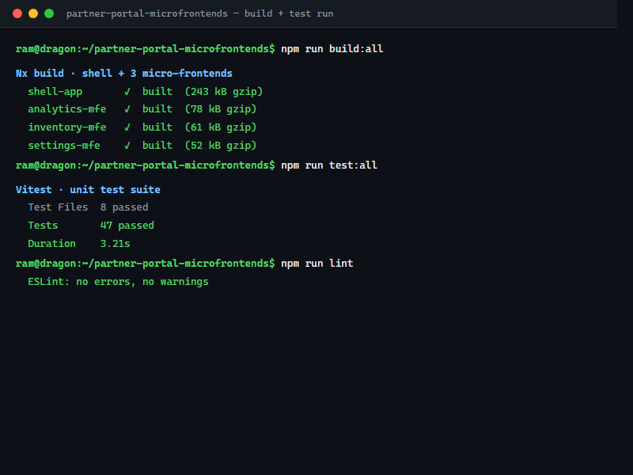
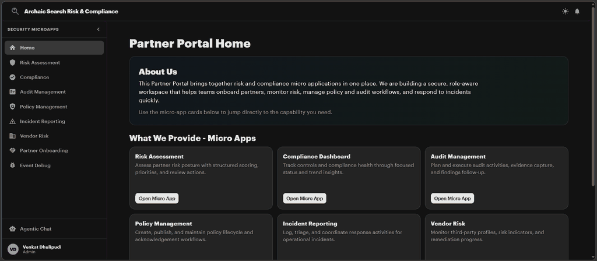
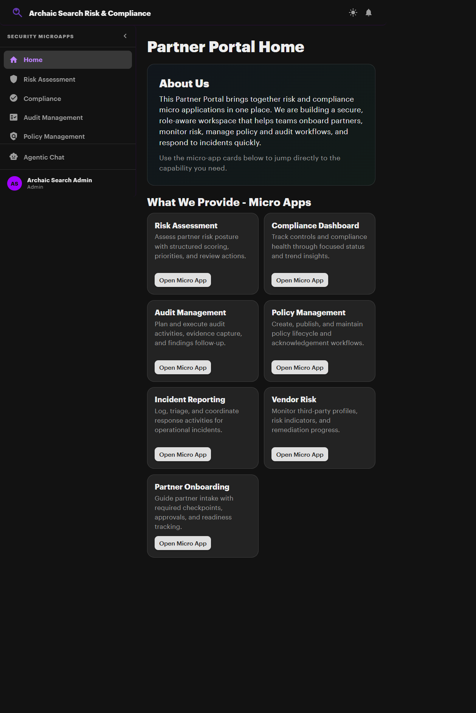

# Partner Portal — Micro-Frontend Architecture

> Modern replacement for the legacy C#/Azure partner portal.  
> Built with **React 19**, **Webpack 5 Module Federation**, **Nx Monorepo**, targeting **Azure** deployment.

## CI Summary

[](https://github.com/Ramdragneel01/partner-portal-microfrontends/actions/workflows/ci.yml)
[](https://github.com/Ramdragneel01/partner-portal-microfrontends/actions/workflows/ci.yml)
[](https://github.com/Ramdragneel01/partner-portal-microfrontends/actions/workflows/ci.yml)

All three gates run in `.github/workflows/ci.yml` on push and pull request validation.

---
## Visual Evidence

Build and test run:


## Architecture

```
┌─────────────────────────────────────────────────────────────────────┐
│                     SHELL (Host) — Port 4200                        │
│  ┌────────────────────────────────────────────────────────────────┐ │
│  │ Header: Branding · User Menu · Notifications · Environment     │ │
│  ├────────┬───────────────────────────────────────────────────────┤ │
│  │ SideNav│                 Content Area                          │ │
│  │        │  ┌──────────────────────────────────────────────────┐ │ │
│  │ Risk   │  │ Remote Micro-App (loaded via Module Federation)  │ │ │
│  │ Compl. │  │                                                  │ │ │
│  │ Audit  │  │  Each app has its own remoteEntry.js             │ │ │
│  │ Policy │  │  React shared as singleton                       │ │ │
│  │ Incid. │  │  Independent build & deploy                      │ │ │
│  │ Vendor │  │  Error boundary per slot                         │ │ │
│  │ Onboard│  └──────────────────────────────────────────────────┘ │ │
│  └────────┴───────────────────────────────────────────────────────┘ │
└─────────────────────────────────────────────────────────────────────┘
```

## Demo Snapshot

Animated preview of shell home running locally with mock auth and mock data enabled:



Static fallback screenshot:



## Micro-Apps

| App | Port | Route | Description |
|-----|------|-------|-------------|
| **Shell (Host)** | 4200 | `/` | Common header, navigation, auth orchestration |
| **Risk Assessment** | 4201 | `/risk-assessment` | Risk register, scoring matrix, trend data |
| **Compliance Dashboard** | 4202 | `/compliance` | Framework posture, control status, scores |
| **Audit Management** | 4203 | `/audit` | Audit plans, findings, remediation tracking |
| **Policy Management** | 4204 | `/policy` | Policy library, approval workflows, versioning |
| **Incident Reporting** | 4205 | `/incidents` | Incident submission, timeline, escalation |
| **Vendor Risk** | 4206 | `/vendor-risk` | Vendor registry, risk scoring, questionnaires |
| **Partner Onboarding** | 4207 | `/onboarding` | Multi-step wizard, KYC, bulk invite |

## Shared Libraries

| Library | Path | Purpose |
|---------|------|---------|
| `@shared/types` | `libs/shared/types` | Domain models, enums, common interfaces |
| `@shared/auth` | `libs/shared/auth` | AuthProvider, useAuth, ProtectedRoute, usePermission |
| `@shared/ui-components` | `libs/shared/ui-components` | Design system (Button, Card, DataTable, Modal, etc.) |
| `@shared/api-client` | `libs/shared/api-client` | HTTP client with auth headers + mock data |
| `@shared/event-bus` | `libs/shared/event-bus` | Typed pub/sub for cross-app communication |

## Quick Start

```bash
# Install dependencies
npm install              # or: 
npm install --legacy-peer-deps

# Start the shell (host) — serves on http://localhost:4200
npm start

# Start ALL apps in parallel (shell + all remotes)
npm run start:all         # or: 
npm run dev

# Start a specific micro-app standalone
npm run start:shell       # Shell on :4200
npm run start:risk        # Risk Assessment on :4201
npm run start:compliance  # Compliance Dashboard on :4202
npm run start:audit       # Audit Management on :4203
npm run start:policy      # Policy Management on :4204
npm run start:incidents   # Incident Reporting on :4205
npm run start:vendor      # Vendor Risk on :4206
npm run start:onboarding  # Partner Onboarding on :4207

# Build all apps
npm run build

# Build only affected apps (CI optimization)
npm run build:affected

# Test
npm test                  # Run all tests once
npm run test:watch        # Watch mode
npm run test:coverage     # Coverage report

# Lint
npm run lint              # Lint all projects
npm run lint:affected     # Lint only affected projects

# View dependency graph
npm run graph
```

## Environment Setup

1. Copy `.env.example` to `.env.development`.
2. Keep `USE_MOCK_AUTH=true` and `USE_MOCK_DATA=true` for local development without backend containers.
3. Choose your mock scale preset:
	- `MOCK_DATA_SCALE=small` — normal local development
	- `MOCK_DATA_SCALE=10k` — moderate load testing
	- `MOCK_DATA_SCALE=100k` — high load testing
	- `MOCK_DATA_SCALE=1m` — stress testing

> Both legacy keys (`USE_*`, `MOCK_DATA_*`) and VITE aliases (`VITE_USE_*`, `VITE_MOCK_DATA_*`) are supported during migration.

### Key Environment Variables

| Variable | Purpose | Default |
|----------|---------|--------|
| `USE_MOCK_AUTH` / `VITE_USE_MOCKED_AUTH` | Bypass Azure AD auth | `true` |
| `USE_MOCK_DATA` / `VITE_USE_MOCKED_DATA` | Use in-memory mock API | `true` |
| `MOCK_DATA_SCALE` | Record count preset | `small` |
| `MOCK_DATA_SEED` | Deterministic data generation | `42` |
| `MSAL_CLIENT_ID` | Azure AD app registration ID | _(required in prod)_ |
| `MSAL_TENANT_ID` | Azure AD tenant ID | _(required in prod)_ |
| `MSAL_REDIRECT_URI` | MSAL callback URL | `http://localhost:4200` |
| `API_SCOPE` | MSAL API permission scope | `api://partner-portal/.default` |
| `API_BASE_URL` | Backend API base URL | `http://localhost:5000/api` |
| `TENANT_ID` | Runtime tenant context header | `tenant-archaic-search-demo` |
| `FEATURE_FLAGS` | Comma-separated feature flags | _(empty)_ |
| `REMOTE_RISK_URL` | Module Federation remote URL | `http://localhost:4201/remoteEntry.js` |
| `REMOTE_COMPLIANCE_URL` | Module Federation remote URL | `http://localhost:4202/remoteEntry.js` |

## RBAC Roles

| Role | Risk | Compliance | Audit | Policy | Incidents | Vendor | Onboarding |
|------|------|-----------|-------|--------|-----------|--------|------------|
| `admin` | Full | Full | Full | Full | Full | Full | Full |
| `compliance-officer` | Create/Edit | Edit/Assess | View | Create | Investigate | Assess | View |
| `auditor` | View | Assess | Create/Edit | View | View | Assess | — |
| `partner` | View | View | — | View | Report | — | Onboard |
| `viewer` | View | View | View | View | View | View | View |

## Tech Stack

| Concern | Technology |
|---------|------------|
| **Framework** | React 19 + TypeScript 6 (strict mode) |
| **Module Federation** | Webpack 5 `ModuleFederationPlugin` |
| **Monorepo** | Nx 22 (`@nx/react`, `@nx/webpack`) |
| **Routing** | React Router DOM v7 |
| **UI Library** | MUI v7 (Material UI) + `@mui/x-charts` + `@mui/icons-material` |
| **Theming** | `PortalThemeProvider` — light/dark mode, CSS custom-property design tokens |
| **Auth** | Azure MSAL (`@azure/msal-browser` / `@azure/msal-react`) — mock provider for local dev |
| **Testing** | Vitest v3 + Testing Library + jest-axe (accessibility) |
| **CI/CD** | GitHub Actions → Azure Static Web Apps |
| **Accessibility** | WCAG 2.1 AA — semantic HTML, ARIA, keyboard navigation, focus indicators |

## Documentation

| Document | Purpose |
|----------|---------|
| [ARCHITECTURE.md](ARCHITECTURE.md) | Full architecture reference — diagrams, data flow, auth, RBAC, events, testing |
| [CONTRIBUTING.md](CONTRIBUTING.md) | Coding standards, PR checklist, dependency rules, accessibility requirements |
| [CHANGELOG.md](CHANGELOG.md) | Release notes and baseline hardening history |
| [docs/GETTING-STARTED.md](docs/GETTING-STARTED.md) | Clone, install, run — onboarding guide for new developers |
| [docs/API.md](docs/API.md) | Backend API endpoints and request/response contracts |
| [docs/DEPLOYMENT.md](docs/DEPLOYMENT.md) | Local, CI, and production deployment guidance |
| [docs/TESTING.md](docs/TESTING.md) | Frontend/backend testing strategy and required checks |
| [docs/ARCHITECTURE-MAP.md](docs/ARCHITECTURE-MAP.md) | Shell-remotes-shared contract map for quick system orientation |
| [docs/EVENT-CONTRACTS.md](docs/EVENT-CONTRACTS.md) | Shared event names, payload contracts, and producer-consumer mapping |
| [docs/ACCESSIBILITY-CHECKLIST.md](docs/ACCESSIBILITY-CHECKLIST.md) | Keyboard and assistive-technology validation checklist |
| [docs/PERFORMANCE-BUDGETS.md](docs/PERFORMANCE-BUDGETS.md) | Performance thresholds and latest Lighthouse measurements |
| [docs/architecture-decisions.md](docs/architecture-decisions.md) | Key architectural decisions with rationale |
| [docs/agentic-chat-blueprint.md](docs/agentic-chat-blueprint.md) | Role-aware Agentic AI chat blueprint with Salesforce/RCA plugin strategy |
| [docs/BACKEND-PODMAN-SETUP.md](docs/BACKEND-PODMAN-SETUP.md) | Podman backend stack, realtime SSE, and deterministic bulk-load runbook |
| [docs/roadmap.md](docs/roadmap.md) | Phased plan for Oscar-inspired enhancements |

Every app and library has its own `README.md` with purpose, rules, and API reference.

## Planned Agentic Chat Capability

- A shell-owned chat experience is planned for platform-wide usage across all micro-app domains.
- Users will choose chat context from role-authorized modules only, using existing module access policy.
- Async plugin execution will support progressive reply states (`running`, `completed`, `failed`) with SSE-driven updates.
- Initial connector focus will prioritize Salesforce and RCA-heavy workflows.
- Reference architecture: [docs/agentic-chat-blueprint.md](docs/agentic-chat-blueprint.md)

## Project Structure

```
partner-portal-microfrontends/
├── apps/
│   ├── shell/                    # Host app
│   ├── risk-assessment/          # Remote: risk register
│   ├── compliance-dashboard/     # Remote: compliance posture
│   ├── audit-management/         # Remote: audit tracking
│   ├── policy-management/        # Remote: policy CRUD
│   ├── incident-reporting/       # Remote: incident response
│   ├── vendor-risk/              # Remote: vendor scoring
│   └── partner-onboarding/       # Remote: onboarding wizard
├── libs/
│   └── shared/
│       ├── types/                # Domain models & enums
│       ├── auth/                 # Auth provider & RBAC
│       ├── ui-components/        # Design system
│       ├── api-client/           # HTTP client & mocks
│       └── event-bus/            # Cross-app events
├── tools/
│   └── webpack/                  # Shared webpack config factory
├── .github/workflows/            # CI + Deploy pipelines
├── docs/                         # Architecture decisions & roadmap
├── nx.json                       # Nx workspace config
├── tsconfig.base.json            # Base TypeScript config
├── package.json                  # Root dependencies & scripts
├── ARCHITECTURE.md               # Full architecture reference
├── CONTRIBUTING.md               # Development guidelines
└── README.md                     # This file
```

## Module Federation Flow

1. Shell loads at `localhost:4200` and initializes React, auth context
2. User navigates to `/risk-assessment`
3. Shell's React Router lazy-loads `import('riskAssessment/Module')`
4. Webpack fetches `localhost:4201/remoteEntry.js` (or production CDN URL)
5. Remote module renders inside the shell's content area
6. React, ReactDOM, react-router-dom shared as **singletons** — no duplication
7. If remote fails, ErrorBoundary renders fallback — other apps unaffected

## Shell Providers

The shell composes all context providers via `AppProviders`:

| Provider | Export | Purpose |
|----------|--------|---------|
| `PortalThemeProvider` | `@shared/ui-components` | MUI light/dark theme with design tokens |
| `SidebarProvider` | `./providers` | Collapsed/expanded sidebar state |
| `I18nProvider` | `./providers` | Locale and translation context (stub, i18n-ready) |
| `AlertManagerProvider` | `./providers` | Global alert/notification pipeline |
| `TenantContextProvider` | `./providers` | Tenant ID, user ID, feature flags → synced to API runtime headers |
| `AuthProvider` | `@shared/auth` | MSAL or mock auth; exposes `useAuth`, `usePermission` |

## Theme System

- `PortalThemeProvider` wraps MUI `ThemeProvider` with support for **light** and **dark** mode.
- `useThemeMode()` hook exposes `{ themeMode, toggleTheme }` — usable in any component.
- Design tokens are available as CSS custom properties via `themeTokens` and `customBrand`.
- The `Header` provides the global theme toggle button.

## Security

- HTTP security headers set in `index.html` (X-Content-Type-Options, X-Frame-Options, Referrer-Policy, Permissions-Policy)
- Auth tokens stored in `sessionStorage` only — never `localStorage` (cleared on tab close)
- RBAC enforced at navigation level (shell) and action level (each micro-app via `usePermission`)
- Navigation events validated against an `ALLOWED_NAV_ROOTS` allowlist — prevents open-redirect attacks
- CORS headers configured in webpack dev server for cross-origin remote loading
- No secrets committed — all sensitive values via GitHub Secrets / environment variables
- `npm audit --omit=dev --audit-level=high` runs as a non-blocking CI/release check

## Release Workflow

- `.github/workflows/release.yml` runs on semantic version tags (`v*.*.*`).
- The workflow runs lint, test, production builds, and publishes `dist/apps` as release artifacts.

## Testing

Required pre-PR validation from repository root:

```bash
npm run lint
npm test
npm run build
```

Targeted validation and accessibility checks are documented in `docs/TESTING.md` and `docs/ACCESSIBILITY-CHECKLIST.md`.

## Limitations

1. Some workflow actions still use placeholder bulk import and invite paths pending backend production parity.
2. Local mock-first operation can hide remote integration gaps if production endpoints are not validated regularly.

## Roadmap

The next implementation milestones are:

1. Replace placeholder bulk import/invite actions with production workflows.
2. Complete live backend integrations for Salesforce/RCA dependent capabilities.
3. Add end-to-end cross-app test coverage for critical business journeys.
4. Expand config-driven rendering adoption from template level to more live module views.
