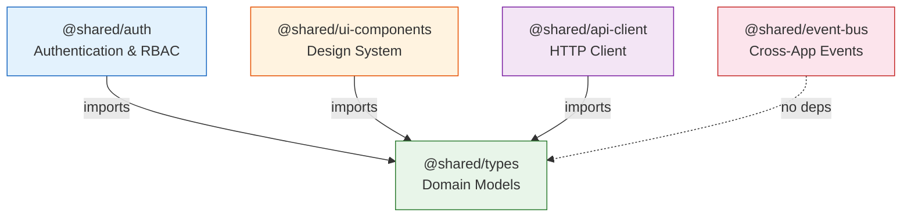

# Shared Libraries

> Reusable packages shared across all micro-apps in the Partner Portal.
> Every library is imported via `@shared/*` path aliases defined in `tsconfig.base.json`.

---

## Library Catalog

| Library | Import Path | Purpose | Depends On |
|---------|-------------|---------|------------|
| **types** | `@shared/types` | Domain models, enums, interfaces | None |
| **auth** | `@shared/auth` | AuthProvider, RBAC, ProtectedRoute | `@shared/types` |
| **ui-components** | `@shared/ui-components` | 11 WCAG-compliant design system components | `@shared/types` |
| **api-client** | `@shared/api-client` | HTTP client with auth token injection + mock data | `@shared/types` |
| **event-bus** | `@shared/event-bus` | Typed pub/sub for cross-app communication | None |

---

## Dependency Graph



---

## Architecture Rules

### Import Rules
1. **Apps → Libs**: Any app may import from any `@shared/*` library.
2. **Libs → Types only**: Libraries may import from `@shared/types`. No other inter-library imports.
3. **No circular dependencies**: If `auth` imports `types`, `types` must not import `auth`.
4. **Barrel exports only**: Always import from `@shared/library-name`, never from `@shared/library-name/src/lib/file`.

### Design Rules
1. **Domain types in `@shared/types`**: Never define domain interfaces in apps or other libraries.
2. **UI components in `@shared/ui-components`**: Never build custom base components in apps.
3. **Events in `@shared/event-bus`**: All cross-app communication through the event bus.
4. **Auth via `@shared/auth`**: All permission checks via the shared auth provider.

### Adding a New Library
1. Create `libs/shared/new-lib/` with `project.json`, `tsconfig.json`, `src/index.ts`.
2. Add path alias in `tsconfig.base.json`: `"@shared/new-lib": ["libs/shared/new-lib/src/index.ts"]`.
3. Add webpack alias in `tools/webpack/remoteConfig.js` and `apps/shell/webpack.config.js`.
4. Create `README.md` in the new library folder.
5. Export all public API from `src/index.ts`.

---

## Path Aliases

Defined in `tsconfig.base.json`:

```json
{
  "paths": {
    "@shared/ui-components": ["libs/shared/ui-components/src/index.ts"],
    "@shared/auth": ["libs/shared/auth/src/index.ts"],
    "@shared/types": ["libs/shared/types/src/index.ts"],
    "@shared/api-client": ["libs/shared/api-client/src/index.ts"],
    "@shared/event-bus": ["libs/shared/event-bus/src/index.ts"]
  }
}
```

These are also mirrored as webpack `resolve.alias` entries in both the shell and remote configs.
