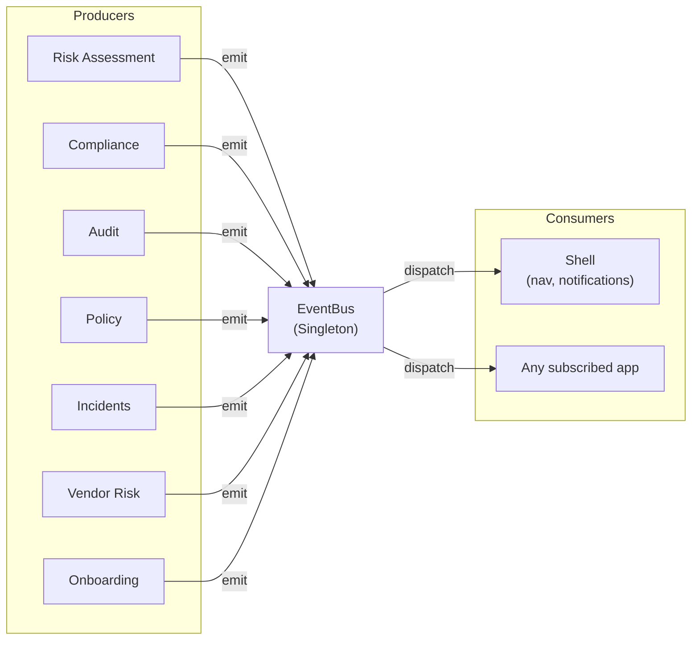

# @shared/event-bus — Cross-App Communication

> Typed publish/subscribe event system for decoupled communication between micro-apps.
> Uses browser-side custom events with automatic cleanup via React hook.

---

## Import

```typescript
import { eventBus, useEventBus, AppEvent } from '@shared/event-bus';
```

---

## Event Types

| Event | Enum Value | Payload |
|-------|------------|---------|
| `RiskUpdated` | `RISK_UPDATED` | `{ riskId: string, riskLevel: string }` |
| `ComplianceStatusChanged` | `COMPLIANCE_STATUS_CHANGED` | `{ controlId: string, newStatus: string }` |
| `AuditFindingCreated` | `AUDIT_FINDING_CREATED` | `{ findingId: string, severity: string }` |
| `PolicyApproved` | `POLICY_APPROVED` | `{ policyId: string, version: string }` |
| `IncidentCreated` | `INCIDENT_CREATED` | `{ incidentId: string, severity: string }` |
| `IncidentResolved` | `INCIDENT_RESOLVED` | `{ incidentId: string }` |
| `VendorRiskChanged` | `VENDOR_RISK_CHANGED` | `{ vendorId: string, newRating: string }` |
| `PartnerOnboarded` | `PARTNER_ONBOARDED` | `{ partnerId: string, companyName: string }` |
| `UserRoleChanged` | `USER_ROLE_CHANGED` | `{ userId: string, newRole: string }` |
| `NavigationRequested` | `NAVIGATION_REQUESTED` | `{ path: string }` |
| `NotificationReceived` | `NOTIFICATION_RECEIVED` | `{ message: string, type: 'info' \| 'warning' \| 'error' \| 'success' }` |

---

## Usage

### Emitting Events

```typescript
import { eventBus, AppEvent } from '@shared/event-bus';

// In a risk assessment component after updating a risk
eventBus.emit(AppEvent.RiskUpdated, { riskId: 'RSK-001', riskLevel: 'high' });

// In incidents after creating a new incident
eventBus.emit(AppEvent.IncidentCreated, { incidentId: 'INC-004', severity: 'critical' });
```

### Subscribing in React Components

```typescript
import { useEventBus, AppEvent } from '@shared/event-bus';

function DashboardWidget() {
  useEventBus(AppEvent.RiskUpdated, (data) => {
    console.log(`Risk ${data.riskId} changed to ${data.riskLevel}`);
    // Refresh widget data
  });

  return <div>...</div>;
}
```

The `useEventBus` hook automatically unsubscribes on component unmount.

### Manual Subscribe/Unsubscribe

```typescript
const unsubscribe = eventBus.on(AppEvent.IncidentCreated, (data) => {
  // handle event
});

// Later...
unsubscribe();
```

### Clearing Listeners

```typescript
eventBus.clear(AppEvent.RiskUpdated);  // Clear listeners for one event
eventBus.clear();                       // Clear ALL listeners
```

---

## Event Flow Diagram



---

## API Reference

### EventBus Class

| Method | Signature | Returns | Description |
|--------|-----------|---------|-------------|
| `on` | `on<E>(event: E, listener: (data) => void)` | `() => void` | Subscribe, returns unsubscribe fn |
| `off` | `off<E>(event: E, listener: (data) => void)` | `void` | Unsubscribe specific listener |
| `emit` | `emit<E>(event: E, data: AppEventPayload[E])` | `void` | Fire event with typed payload |
| `clear` | `clear(event?: AppEvent)` | `void` | Remove listeners |

### useEventBus Hook

```typescript
useEventBus<E extends AppEvent>(event: E, handler: (data: AppEventPayload[E]) => void): void
```

Auto-cleans up on unmount. The handler is memoized via `useCallback`.

---

## Architecture Rules

1. **All cross-app communication via event bus**. Never import between apps.
2. **Typed payloads**. Every event has a defined `AppEventPayload[E]` type.
3. **Always use `useEventBus` in React**. Ensures cleanup on unmount.
4. **Error isolation**. Listener errors are caught and logged — they don't propagate.
5. **No dependencies**. This library imports only React hooks (`useEffect`, `useCallback`).

---

## Adding a New Event

1. Add entry to `AppEvent` enum in `src/index.ts`.
2. Add typed payload to `AppEventPayload` interface.
3. Document in this README's Event Types table.
4. Document in `ARCHITECTURE.md` → Event Types table.
5. Use `eventBus.emit()` in producer and `useEventBus()` in consumers.

---

## Key Files

| File | Purpose |
|------|---------|
| `src/index.ts` | EventBus class, AppEvent enum, useEventBus hook, singleton instance |
